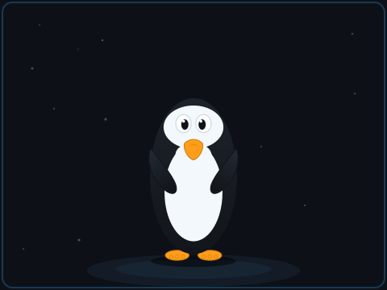

<!--
  ❄ ssmurfgg04-gif — arctic tuxedo edition
  100% self-hosted visual system:
  · assets/hero-banner.svg  → animated SVG (aurora · snowfall · waddling, blinking Tux)
  · assets/tux-dance.gif    → 30-frame hand-rendered penguin loop
  · output/snake-*.svg      → regenerated daily by .github/workflows/snake.yml
-->

  

 

  

---

## 🐧 The Penguin File

<table>
<tr>
<td width="58%" valign="top">

**Species** — *Spheniscus developericus*: the tuxedo penguin. Upright posture, sleek swimmer, looks like it has its life together.

**Habitat** — Nairobi 🇰🇪, deploying worldwide. Warm body, cold cache.

**Diet** — coffee, bug bounties, distributed systems, and the occasional 40GB CSV.

**Superpower** — belly-slides from `main` to production without spilling the coffee.

**Current status** — hireable · hunting bounties · shipping Rust at −40°C.

</td>
<td width="42%" valign="middle" align="center">

*me, deploying to prod on a friday*

</td>
</tr>
</table>

---

## 🧊 The Ice Shelf — five things worth pinning

| | project | what it does |
|:---:|:---|:---|
| ⏰ | [**cronlish**](https://github.com/ssmurfgg04-gif/cronlish)  | cron expressions → plain human language. Tiny, deterministic, stdlib-only — with a **$400 open bounty** |
| 🗿 | [**cairn**](https://github.com/ssmurfgg04-gif/cairn)  | content-addressed chunked sync & storage for professional video teams — git-for-video, written in Rust |
| 🧠 | [**cortexm**](https://github.com/ssmurfgg04-gif/context-m)  | deterministic agent memory — μ=0, free, local, forever. Mem0-compatible, zero LLM calls |
| 🔪 | [**dsv**](https://github.com/ssmurfgg04-gif/dsv)  | the data swiss knife — CSV / Parquet / JSONL CLI in Rust. Modern xsv with all 33 community PRs merged |
| ⚔️ | [**太一剑宗 Taiyi Sword Sect**](https://github.com/ssmurfgg04-gif/taiyi-sword-sect)  | cinematic wuxia single-page experience — ink, paper & cinnabar, animated with anime.js v4 |

**→ the rest of the shelf:** [54 public repos](https://github.com/ssmurfgg04-gif?tab=repositories) — POS systems for Kenyan businesses, physics playgrounds, cultivation frameworks, and other experiments that refused to stay in drafts.

---

## 📊 Vital Signs

  
  

  

---

## 🛠️ Toolbelt

  

---

## 🏆 The Trophy Case

  
  
  
  
  
  

| arctic record | the ice remembers |
|:---|:---|
| 🥇 most-starred repo | [cronlish](https://github.com/ssmurfgg04-gif/cronlish) — six stars and climbing, one belly-slide at a time |
| 💪 hardest flex | three Rust engines and counting — video storage, data tooling, no fear |
| 🧊 chill factor | penguins can't fly. neither can deploys on fridays. we ship anyway |
| 🐧 spirit animal | formal but chaotic · resilient underdog · tuxedo at all times |

---

## 🐍 The Snake That Eats My Contributions

  <picture>
    <source media="(prefers-color-scheme: dark)" srcset="https://raw.githubusercontent.com/ssmurfgg04-gif/ssmurfgg04-gif/output/snake-dark.svg" />
    <source media="(prefers-color-scheme: light)" srcset="https://raw.githubusercontent.com/ssmurfgg04-gif/ssmurfgg04-gif/output/snake.svg" />
    
  </picture>

  an orange beak eating ice-blue dots · regenerated daily by <a href="https://github.com/ssmurfgg04-gif/ssmurfgg04-gif/blob/main/.github/workflows/snake.yml">arctic-snake.yml</a>

---

🐧 sudo make me a sandwich

 okay. one belly-slide, coming up. 🥪

---

  

  
  
  
    
  <i>"Talk is cheap. Show me the penguin."</i> — loosely, <a href="https://github.com/torvalds">the man who made the penguin famous</a> 
  crafted at −40°C by <a href="https://github.com/ssmurfgg04-gif">a penguin with commit access</a> 🐧❄️

