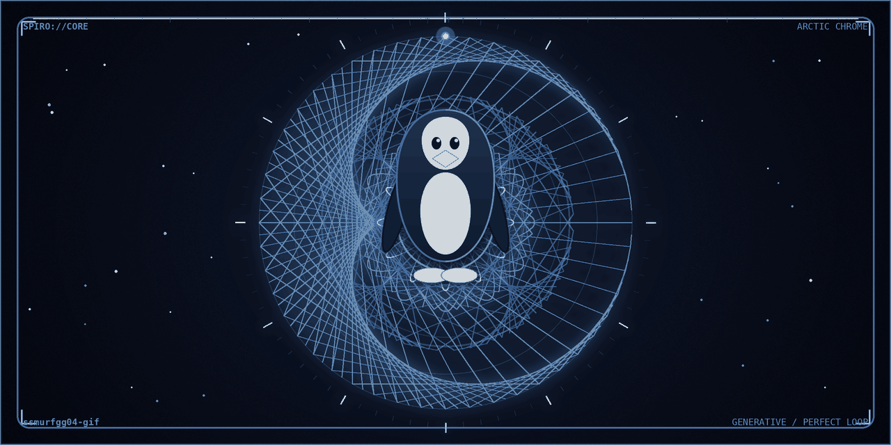
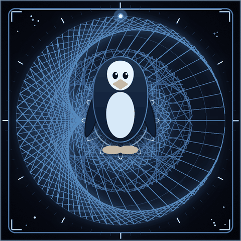

<!-- arctic.chrome v5.0 — 100% self-hosted visual system:
     assets/hero.gif       → generative spirograph mandala · steel-cyan on deep navy · perfect 4.3s loop
     assets/spiro-core.gif → pocket mandala · same geometry, breathing in the whoami panel
     output/snake-*.svg    → regenerated daily by .github/workflows/snake.yml -->

  

 

  <a href="https://git.io/typing-svg">
    <picture>
      <source media="(prefers-color-scheme: dark)" srcset="https://readme-typing-svg.demolab.com?font=JetBrains+Mono&weight=600&size=21&pause=1400&color=9CCFD8&center=true&vCenter=true&random=false&width=650&height=100&lines=full-stack+builder+%E2%80%94+Nairobi+%E2%86%92+the+world;python+%C2%B7+rust+%C2%B7+typescript+%C2%B7+whatever+ships;cold+code%2C+warm+commits" />
      <source media="(prefers-color-scheme: light)" srcset="https://readme-typing-svg.demolab.com?font=JetBrains+Mono&weight=600&size=21&pause=1400&color=0E7490&center=true&vCenter=true&random=false&width=650&height=100&lines=full-stack+builder+%E2%80%94+Nairobi+%E2%86%92+the+world;python+%C2%B7+rust+%C2%B7+typescript+%C2%B7+whatever+ships;cold+code%2C+warm+commits" />
      
    </picture>
  </a>

---

## ~/whoami

<table>
<tr>
<td width="58%" valign="top">

**Species** — *Spheniscus developericus*: the tuxedo penguin. Upright posture, sleek swimmer, looks like it has its life together.

**Habitat** — Nairobi, Kenya. Deploys worldwide. Warm body, cold cache.

**Diet** — coffee, bug bounties, distributed systems, and the occasional 40GB CSV.

**Superpower** — belly-slides from `main` to production without spilling the coffee.

**Current status** — hireable · building in the open · shipping Rust at 60fps.

</td>
<td width="42%" valign="middle" align="center">

*me, deploying to prod on a friday*

</td>
</tr>
</table>

---

## ~/featured — five things worth pinning

| | project | what it does |
|:---:|:---|:---|
| 01 | [**falling-sand**](https://github.com/ssmurfgg04-gif/falling-sand)  | an entire physics playground in one HTML file — 14 materials, lava, gunpowder, gardens · [play it live](https://ssmurfgg04-gif.github.io/falling-sand/) |
| 02 | [**cairn**](https://github.com/ssmurfgg04-gif/cairn)  | content-addressed chunked sync &amp; storage for professional video teams — git-for-video, written in Rust |
| 03 | [**cortexm**](https://github.com/ssmurfgg04-gif/context-m)  | deterministic agent memory — μ=0, free, local, forever. Mem0-compatible, zero LLM calls |
| 04 | [**dsv**](https://github.com/ssmurfgg04-gif/dsv)  | the data swiss knife — CSV / Parquet / JSONL CLI in Rust. Modern xsv with all 33 community PRs merged |
| 05 | [**太一剑宗 Taiyi Sword Sect**](https://github.com/ssmurfgg04-gif/taiyi-sword-sect)  | cinematic wuxia single-page experience — ink, paper &amp; cinnabar, animated with anime.js v4 |

**→ the rest of the shelf:** [54 public repos](https://github.com/ssmurfgg04-gif?tab=repositories) — POS systems for Kenyan businesses, physics playgrounds, cultivation frameworks, and other experiments that refused to stay in drafts.

---

## ~/stats

  <a href="https://github.com/ssmurfgg04-gif" alt="GitHub stats">
    <picture>
      <source media="(prefers-color-scheme: dark)" srcset="https://raw.githubusercontent.com/ssmurfgg04-gif/ssmurfgg04-gif/output/stats-dark.svg" />
      <source media="(prefers-color-scheme: light)" srcset="https://raw.githubusercontent.com/ssmurfgg04-gif/ssmurfgg04-gif/output/stats-light.svg" />
      
    </picture>
  </a>
  <a href="https://github-readme-streak-stats.herokuapp.com/?user=ssmurfgg04-gif" alt="Streak stats">
    <picture>
      <source media="(prefers-color-scheme: dark)" srcset="https://github-readme-streak-stats.herokuapp.com/?user=ssmurfgg04-gif&hide_border=true&background=0B0F1A&stroke=0B0F1A&ring=05D9E8&fire=FF2A6D&currStreakLabel=9CCFD8&sideLabels=6E6A86&currStreakNum=F6C177&sideNums=9CCFD8&dates=6E6A86" />
      <source media="(prefers-color-scheme: light)" srcset="https://github-readme-streak-stats.herokuapp.com/?user=ssmurfgg04-gif&hide_border=true&background=EAF0F6&stroke=EAF0F6&ring=0891B2&fire=FF2A6D&currStreakLabel=39516B&sideLabels=64748B&currStreakNum=D97706&sideNums=39516B&dates=64748B" />
      
    </picture>
  </a>

  <picture>
    <source media="(prefers-color-scheme: dark)" srcset="https://github-readme-stats.vercel.app/api/top-langs/?username=ssmurfgg04-gif&layout=compact&langs_count=8&hide_border=true&bg_color=0B0F1A&title_color=05D9E8&text_color=9CCFD8&icon_color=FF2A6D&ring_color=FF2A6D" />
    <source media="(prefers-color-scheme: light)" srcset="https://github-readme-stats.vercel.app/api/top-langs/?username=ssmurfgg04-gif&layout=compact&langs_count=8&hide_border=true&bg_color=EAF0F6&title_color=0891B2&text_color=39516B&icon_color=BE185D&ring_color=FF2A6D" />
    
  </picture>

---

## ~/stack

  <a href="https://skillicons.dev">
    <picture>
      <source media="(prefers-color-scheme: dark)" srcset="https://skillicons.dev/icons?i=py,ts,rust,js,html,css,astro,react,nodejs,tailwind,docker,git,githubactions,linux,vim,sqlite&perline=8&theme=dark" />
      <source media="(prefers-color-scheme: light)" srcset="https://skillicons.dev/icons?i=py,ts,rust,js,html,css,astro,react,nodejs,tailwind,docker,git,githubactions,linux,vim,sqlite&perline=8&theme=light" />
      
    </picture>
  </a>

---

## ~/records

  
  
  
  
  

| record | the terminal remembers |
|:---|:---|
| showpiece | [falling-sand](https://github.com/ssmurfgg04-gif/falling-sand) — a whole physics engine in one HTML file, zero dependencies, 43k cells at 60fps |
| hardest flex | three Rust engines and counting — video storage, data tooling, no fear |
| unit | UNIT-04 · formal but chaotic · tuxedo at all times |
| protocol | penguins can't fly. neither can deploys on fridays. we ship anyway |

---

## ~/snake

  <picture>
    <source media="(prefers-color-scheme: dark)" srcset="https://raw.githubusercontent.com/ssmurfgg04-gif/ssmurfgg04-gif/output/snake-dark.svg" />
    <source media="(prefers-color-scheme: light)" srcset="https://raw.githubusercontent.com/ssmurfgg04-gif/ssmurfgg04-gif/output/snake.svg" />
    
  </picture>

  a magenta beak eating cyan dots · regenerated daily by <a href="https://github.com/ssmurfgg04-gif/ssmurfgg04-gif/blob/main/.github/workflows/snake.yml">neon-snake.yml</a>

---

sudo make me a sandwich

 okay. one belly-slide, coming up.

---

  <picture>
    <source media="(prefers-color-scheme: dark)" srcset="https://capsule-render.vercel.app/api?type=waving&color=0:05D9E8,50:7700FF,100:0B0F1A&height=90&section=footer" />
    <source media="(prefers-color-scheme: light)" srcset="https://capsule-render.vercel.app/api?type=waving&color=0:A5F3FC,50:BAE6FD,100:FFFFFF&height=90&section=footer" />
    
  </picture>

  
  
  
    
  <i>"Talk is cheap. Show me the penguin."</i> — loosely, <a href="https://github.com/torvalds">the man who made the penguin famous</a> 
  handcrafted in the neon district by <a href="https://github.com/ssmurfgg04-gif">a penguin with commit access</a>

